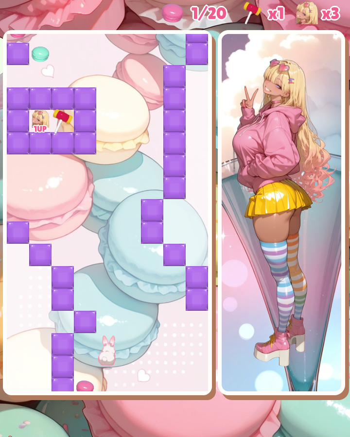
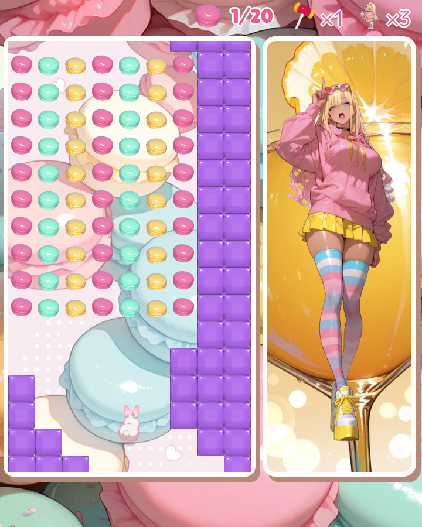
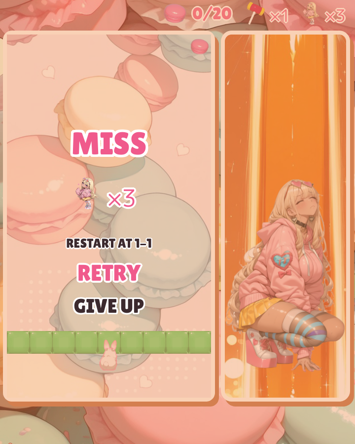
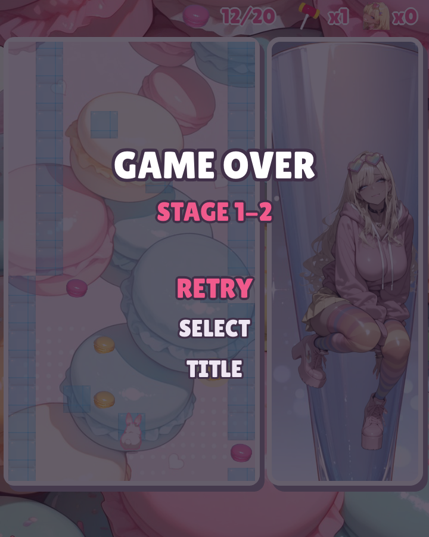

[](https://github.com/nao1215/rabbitrun/actions/workflows/unit_test.yml) [](https://github.com/nao1215/rabbitrun/actions/workflows/golangci-lint.yml) [](https://github.com/nao1215/rabbitrun/actions/workflows/release-smoke.yml)   [](https://scorecard.dev/viewer/?uri=github.com/nao1215/rabbitrun)


# Rabbit Run

Rabbit Run is a short, sweets-themed road runner. A bunny hops up a road built of gummy blocks; you slide her left and right, pick up macarons and stay off the walls. A run takes about three minutes. It is written in Go with [Ebitengine](https://ebitengine.org/) and runs on Linux, macOS and Windows.

| Title | Character select | Play |
| :---: | :---: | :---: |
|  |  |  |

| A vault | A feast | The hammer |
| :---: | :---: | :---: |
|  |  |  |

| Miss | Game over | Gallery |
| :---: | :---: | :---: |
|  |  |  |

## About this game

The road scrolls down toward the bunny and gets faster course by course. A run is four stages of four courses, sixteen courses in all. Every course has a theme of its own: a narrow road winding in long curves, a road that swings from one side of the screen to the other, slaloms, gates with a gap of two, pillars, lanes, a checkerboard of blocks, and more. Each character runs her own roads, so the courses are different for every character, and the roads are the same every time you play, so you can learn them.

The courses run on from one to the next. Along the way you will find:

- Macarons: Collect them for extra lives. The first life comes after 20 (the opening course lays a trail of them for you); after that, every 150. A retry does not bring back the sweets of the rows you go back over. A glowing macaron counts for three.
- Bonus courses: One course in each stage after the first is walled with blocks of every candy color. Its road is wider, it has twice the sweets, and partway along the road is covered in macarons. Help yourself.
- Vaults: An extra life and a hammer locked in a cage of blocks. Only a hammer opens it, and you get it back.
- The hammer: A pop squeaky toy hammer. Set it off and every wall on the screen is smashed. You start with one, and now and then one lies on the road, more rarely as the stages go on.

Hold up to speed the road up yourself (up to 30% faster; it lasts for the rest of the stage). The music speeds up with the road.

Run into a wall, from the front or from the side, and it is a miss. Use a life to retry: you go back ten rows, to the same road. With no lives left, or if you give up, the game is over.

Every course you clear unlocks an illustration of your character, and it becomes the background of the next course. You can view every unlocked picture any time in the gallery.

You play alongside a character who stands next to the road. She watches the run and changes her expression and pose: she relaxes on a wide road, gets nervous as it narrows, cheers when you pick up the glowing macaron or clear a stage, and cries when you hit a wall. The bunny you steer is the same for everyone; your character's face counts your lives.

Every part of this game was made with AI: the program, the characters and illustrations, the blocks and items, the backgrounds and the music arrangements. I have been interested in making games since I was a student, and I wanted to find out what work is still left for a person when a game is built together with AI.

| Character | Look | Portraits (planned) | Illustrations (planned) |
| --- | --- | :---: | :---: |
| Cool | Silver bob, white leather jacket and black leather pants | 86 | 30 |
| Cute | Wavy mint hair, white beret, lavender cardigan and mint pencil skirt | 86 | 30 |
| Gyaru | Tan skin, long blond hair, pink hoodie and rainbow thighhighs | 87 | 30 |
| Taisho Romance | Black hair with red inner color, pink arrow-pattern kimono, hakama and lace-up boots | 86 | 30 |
| Secret | ? | 86 | 30 |

The portraits cover about twenty situations (for example normal, a sweet picked up, a narrow road, a miss, game over and the comeback after a retry) with several poses each. Some of them are still being drawn.

The music is Vivaldi's *Four Seasons* arranged as drum and bass, one season for each screen: Spring on the title, Autumn on character select, Winter on the road and Summer in the gallery.

## How to play

| Action | Keyboard | Gamepad |
| --- | --- | --- |
| Move | ← → / A D / H L | D-pad left / right |
| Speed up (for the rest of the stage) | ↑ / W / K | D-pad up |
| Hammer (smash the walls) | Space / Enter | A |
| Pause | Esc / P / F1 | Start |
| Menu up / down | ↑ ↓ / W S / K J | D-pad up / down |
| Confirm / back | Enter / Esc | A / B |
| Switch character in the gallery | Q / E | LB / RB |

Choose PLAY on the title screen, pick a character, and the run starts. GALLERY shows the character portraits you have seen and the illustrations you have unlocked. Your progress is saved to `rabbitrun/save.json` in the user config directory (`~/.config` on Linux, `~/Library/Application Support` on macOS, `%AppData%` on Windows).

| Option | Description |
| --- | --- |
| `-h`, `--help` | Show the help and exit. |
| `-V`, `--version` | Print the version and exit. |
| `--debug` | Unlock every character, portrait and illustration for this run. The save data is not changed. |
| `--reset-save` | Delete the save data and start from the beginning. The old save is kept next to it as `save.json.bak`. |
| `--capture DIR` | Save a screenshot of every screen to `DIR` and exit. |
| `--bgm-wav DIR` | Write each background music arrangement to `DIR` as WAV and exit. |
| `--record-demo FILE` | Let the game play by itself and save it as a video to `FILE` (needs ffmpeg). |

## How to install

### Download a release

Download the archive for your OS from the [releases page](https://github.com/nao1215/rabbitrun/releases), unpack it and run `rabbitrun` (`rabbitrun.exe` on Windows). Linux users can also install the `.deb`, `.rpm` or `.apk` package. Binaries are built for amd64 and arm64.

### go install

```shell
go install github.com/nao1215/rabbitrun@latest
```

On Linux, Ebitengine is built with cgo by default, so you need the OpenGL, X11 and ALSA development packages described in the [Ebitengine install guide](https://ebitengine.org/en/documents/install.html). On Debian or Ubuntu:

```shell
sudo apt install gcc libc6-dev libgl1-mesa-dev libxcursor-dev libxi-dev libxinerama-dev libxrandr-dev libxxf86vm-dev libasound2-dev pkg-config
```

You can also build without cgo. The game then loads the same libraries at run time:

```shell
CGO_ENABLED=0 go install github.com/nao1215/rabbitrun@latest
```

Rabbit Run needs Go 1.25 or later. CI tests Go 1.25, 1.26, 1.27 and the latest release on Linux, macOS and Windows.

### Verifying release integrity

Each release publishes `checksums.txt`, a cosign signature bundle for it, an SBOM for each archive, and GitHub build provenance.

```shell
# Verify the signature of checksums.txt (keyless, via Sigstore)
cosign verify-blob \
  --bundle checksums.txt.sigstore.json \
  --certificate-identity-regexp '^https://github.com/nao1215/rabbitrun/' \
  --certificate-oidc-issuer https://token.actions.githubusercontent.com \
  checksums.txt

# Check the archive you downloaded against it
sha256sum --ignore-missing -c checksums.txt

# Verify the build provenance of an archive
gh attestation verify rabbitrun_<version>_linux_amd64.tar.gz --repo nao1215/rabbitrun
```

## Contributing

Bug reports, ideas and pull requests are welcome. See [CONTRIBUTING.md](./CONTRIBUTING.md) for how to build, test and lint the game.

## Contributors

Thanks goes to these wonderful people ([emoji key](https://allcontributors.org/docs/en/emoji-key)):

<!-- ALL-CONTRIBUTORS-LIST:START - Do not remove or modify this section -->
<!-- prettier-ignore-start -->
<!-- markdownlint-disable -->
<table>
  <tbody>
    <tr>
      <td align="center" valign="top" width="14.28%"><a href="https://debimate.jp/"><br /><sub><b>CHIKAMATSU Naohiro</b></sub></a><br /><a href="https://github.com/nao1215/rabbitrun/commits?author=nao1215" title="Code">💻</a> <a href="#design-nao1215" title="Design">🎨</a> <a href="#audio-nao1215" title="Audio">🔊</a></td>
    </tr>
  </tbody>
</table>

<!-- markdownlint-restore -->
<!-- prettier-ignore-end -->

<!-- ALL-CONTRIBUTORS-LIST:END -->

This project follows the [all-contributors](https://github.com/all-contributors/all-contributors) specification. Contributions of any kind welcome!

## Spoilers

Open these only if you want to know the secrets.

<details>
<summary>Secret character</summary>

The fifth card on the character select screen shows only a silhouette until each of the first four characters has cleared the game (run all sixteen courses to the end).

</details>

<details>
<summary>Secret command</summary>

Clear the game with the secret character, and the next title screen tells you the secret word. On the title screen, type `RABBITRUN` on the keyboard, in capitals. The extra stages open: every character runs a new, tighter set of courses and unlocks another fifteen illustrations, and the title shows all the characters together. Type it again to go back to the regular stages; the game always starts on the regular ones. Once you have typed it, the gallery also lists the extra illustrations.

</details>

<details>
<summary>The last reward</summary>

Clear the extra stages with every character, and the title screen gets an illustration of its own.

</details>

If you just want to see every character and picture, start the game with `--debug`, or look at the images in this repository on GitHub. That is the easy way, but I hope you will play the game and unlock them yourself.
