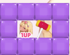

[](https://github.com/nao1215/rabbitrun/actions/workflows/unit_test.yml) [](https://github.com/nao1215/rabbitrun/actions/workflows/golangci-lint.yml) [](https://github.com/nao1215/rabbitrun/actions/workflows/release-smoke.yml)   [](https://scorecard.dev/viewer/?uri=github.com/nao1215/rabbitrun)


# Rabbit Run

Rabbit Run is a short road runner with sweets. A bunny hops up a road of gummy blocks. It is written in Go with [Ebitengine](https://ebitengine.org/) and runs on Linux, macOS and Windows.

| Title | Character select | Play |
| :---: | :---: | :---: |
|  |  |  |

| A vault | A feast | The hammer |
| :---: | :---: | :---: |
|  |  |  |

| An illustration behind the road | Game over | Gallery |
| :---: | :---: | :---: |
|  |  |  |

## About this game

Slide the bunny left and right, pick up macarons and keep off the walls. The road scrolls toward her and speeds up course by course. A run is 4 stages of 4 courses, about three minutes.

- Each course has a theme: winding roads, swings, slaloms, gates, pillars, lanes, checkers and more.
- Each character has her own roads. They are the same every time, so you can learn them.
- Hit a wall, from the front or the side, and it is a miss. A life sends you back ten rows to retry. With no lives left, or if you give up, the game is over.
- Hold up to speed the road up by as much as 30% for the rest of the stage. The music speeds up with it.

| | Item | What it does |
| :---: | --- | --- |
|  | Macaron | Lives come from macarons: the first after 20 (the first course lays a trail of them), then one every 150. Macarons you go back over on a retry do not come back. |
|  | Glowing macaron | Counts as three. |
|  | Hammer | Smashes every wall on the screen. You start with one; more lie on the road now and then, fewer in later stages. |
|  | 1UP | An extra life. |
|  | Vault | A 1UP and a hammer locked in blocks. Only a hammer opens it, and you get that hammer back. |

From the second stage on, one course per stage is a bonus course with candy-colored blocks: a wider road, twice the macarons, and a stretch covered in them.

Each course you clear unlocks an illustration of your character, which becomes the background of the next course. The gallery shows everything you have unlocked.

| An unlocked illustration | Behind the next course |
| :---: | :---: |
|  |  |

Your character stands beside the road and reacts to the run: she relaxes on a wide road, gets nervous when it narrows, cheers at a glowing macaron or a cleared stage, and cries at a miss. Her face counts your lives. The bunny you steer is the same for every character.


| Character | Portraits | Illustrations |
| :---: | :---: | :---: |
|  | 86 | 15 + α |
|  | 86 | 15 + α |
|  | 87 | 15 + α |
|  | 86 | 15 + α |
|  | 86 | 15 + α |

The portraits cover about twenty situations (a sweet picked up, a narrow road, a miss, a retry and more), with several poses each. Some are still being drawn. α is what the secrets unlock.

The music is Vivaldi's *Four Seasons* arranged as drum and bass: Spring on the title, Autumn on character select, Winter on the road, Summer in the gallery.

Everything in this game was made with AI: the program, the characters and illustrations, the blocks and items, the backgrounds and the music arrangements. I have wanted to make games since I was a student, and I wanted to find out what is left for a person to do when a game is built with AI.

## How to play

| Action | Keyboard | Gamepad |
| --- | --- | --- |
| Move | ← → / A D / H L | D-pad left / right |
| Speed up (for the rest of the stage) | ↑ / W / K | D-pad up |
| Hammer (smash the walls) | Space / Enter | A |
| Pause | Esc / P / F1 | Start |
| Menu up / down | ↑ ↓ / W S / K J | D-pad up / down |
| Confirm / back | Enter / Esc | A / B |
| Switch character in the gallery | Q / E | LB / RB |

Choose PLAY on the title screen, pick a character, and the run starts. GALLERY shows the character portraits you have seen and the illustrations you have unlocked. Your progress is saved to `rabbitrun/save.json` in the user config directory (`~/.config` on Linux, `~/Library/Application Support` on macOS, `%AppData%` on Windows).

| Option | Description |
| --- | --- |
| `-h`, `--help` | Show the help and exit. |
| `-V`, `--version` | Print the version and exit. |
| `--debug` | Unlock every character, portrait and illustration for this run. The save data is not changed. |
| `--reset-save` | Delete the save data and exit without starting the game. The old save is kept next to it as `save.json.bak`. |
| `--capture DIR` | Save a screenshot of every screen to `DIR` and exit. |
| `--bgm-wav DIR` | Write each background music arrangement to `DIR` as WAV and exit. |
| `--record-demo FILE` | Let the game play by itself and save it as a video to `FILE` (needs ffmpeg). |

## How to install

### Use "go install"

```shell
go install github.com/nao1215/rabbitrun@latest
```

No C compiler is needed. On Linux the game needs the X11, OpenGL and ALSA libraries listed in the [Ebitengine install guide](https://ebitengine.org/en/documents/install.html). On Debian or Ubuntu:

```shell
sudo apt install libx11-6 libgl1 libglx-mesa0 libxcursor1 libxi6 libxinerama1 libxrandr2 libxrender1 libxext6 libasound2t64
```

Rabbit Run needs Go 1.26.6 or later. CI tests Go 1.26.6 and the latest release on Linux, macOS and Windows.

### Use homebrew

```shell
brew install --cask nao1215/tap/rabbitrun
```

### Install from Package or Binary

[The release page](https://github.com/nao1215/rabbitrun/releases) contains packages in .deb, .rpm, and .apk formats for `amd64` and `arm64`, plus `.tar.gz` archives for Linux/macOS and `.zip` archives for Windows. Unpack an archive and run `rabbitrun` (`rabbitrun.exe` on Windows), or install a package:

```shell
# Debian, Ubuntu
$ sudo dpkg -i rabbitrun_1.0.0_linux_amd64.deb

# Fedora, RHEL, openSUSE
$ sudo rpm -Uvh rabbitrun_1.0.0_linux_amd64.rpm

# Alpine Linux
$ sudo apk add --allow-untrusted rabbitrun_1.0.0_linux_amd64.apk
```

Replace `1.0.0` with the release you downloaded and `amd64` with `arm64` where applicable.

### Verifying release integrity

Each release publishes `checksums.txt`, a cosign signature bundle for it, an SBOM for each archive, SLSA build provenance (`multiple.intoto.jsonl`) and GitHub build provenance.

```shell
# Verify the signature of checksums.txt (keyless, via Sigstore)
cosign verify-blob \
  --bundle checksums.txt.sigstore.json \
  --certificate-identity-regexp '^https://github.com/nao1215/rabbitrun/' \
  --certificate-oidc-issuer https://token.actions.githubusercontent.com \
  checksums.txt

# Check the archive you downloaded against it
sha256sum --ignore-missing -c checksums.txt

# Verify the SLSA provenance of an archive
slsa-verifier verify-artifact \
  --provenance-path multiple.intoto.jsonl \
  --source-uri github.com/nao1215/rabbitrun \
  --source-tag v<version> \
  rabbitrun_<version>_linux_amd64.tar.gz

# Verify the GitHub build provenance of an archive
gh attestation verify rabbitrun_<version>_linux_amd64.tar.gz --repo nao1215/rabbitrun
```

## Contributing

Bug reports, ideas and pull requests are welcome. See [CONTRIBUTING.md](./CONTRIBUTING.md) for how to build, test and lint the game.

## Contributors

Thanks to these people ([emoji key](https://allcontributors.org/docs/en/emoji-key)):

<!-- ALL-CONTRIBUTORS-LIST:START - Do not remove or modify this section -->
<!-- prettier-ignore-start -->
<!-- markdownlint-disable -->
<table>
  <tbody>
    <tr>
      <td align="center" valign="top" width="14.28%"><a href="https://debimate.jp/"><br /><sub><b>CHIKAMATSU Naohiro</b></sub></a><br /><a href="https://github.com/nao1215/rabbitrun/commits?author=nao1215" title="Code">💻</a> <a href="#design-nao1215" title="Design">🎨</a> <a href="#audio-nao1215" title="Audio">🔊</a></td>
    </tr>
  </tbody>
</table>

<!-- markdownlint-restore -->
<!-- prettier-ignore-end -->

<!-- ALL-CONTRIBUTORS-LIST:END -->

This project follows the [all-contributors](https://github.com/all-contributors/all-contributors) specification. Contributions of any kind welcome!

## Spoilers

Open these only if you want to know the secrets.

<details>
<summary>Secret character</summary>

The fifth card on the character select screen shows only a silhouette until each of the first four characters has cleared the game (run all sixteen courses to the end).

</details>

<details>
<summary>Secret command</summary>

Clear the game with the secret character, and the next title screen tells you the secret word. On the title screen, type `RABBITRUN` on the keyboard, in capitals. The extra stages open: every character runs a new, tighter set of courses and unlocks another fifteen illustrations, and the title shows all the characters together. Type it again to go back to the regular stages; the game always starts on the regular ones. Once you have typed it, the gallery also lists the extra illustrations.

</details>

<details>
<summary>The last reward</summary>

Clear the extra stages with every character, and the title screen gets an illustration of its own.

</details>

If you just want to see every character and picture, start the game with `--debug`, or look at the images in this repository on GitHub. I hope you play and unlock them yourself, though.
