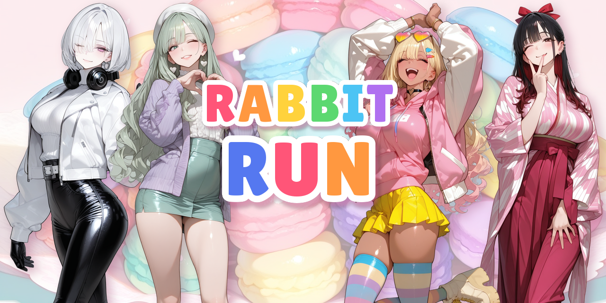
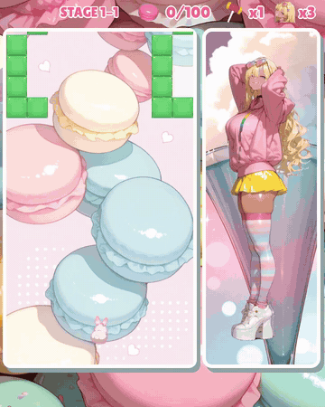
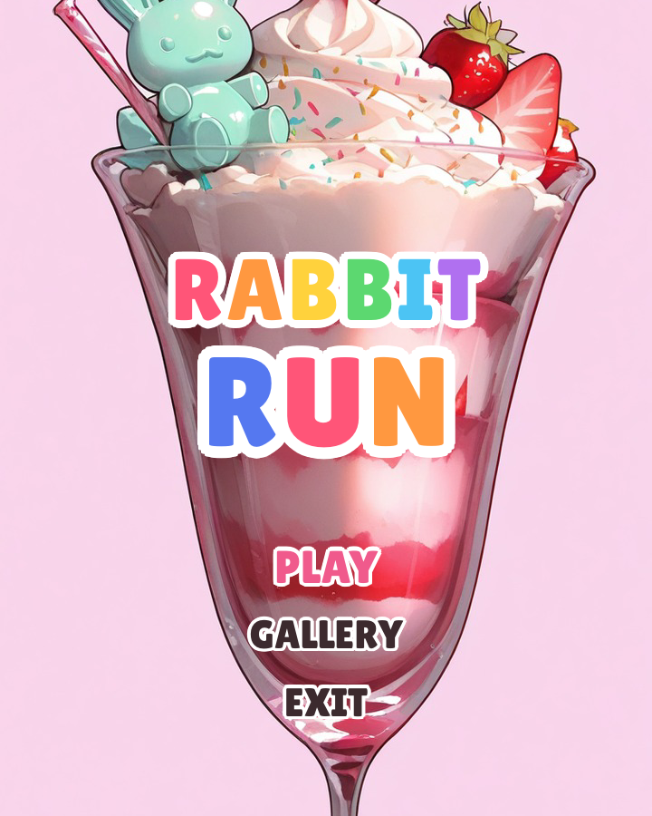
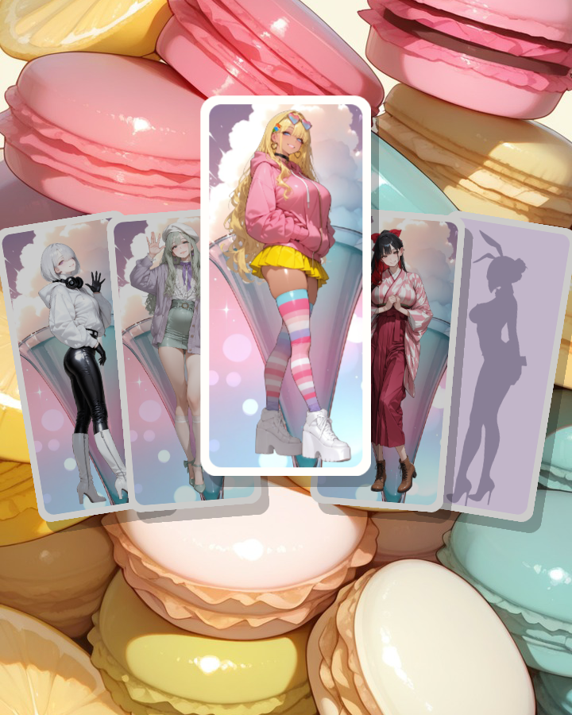
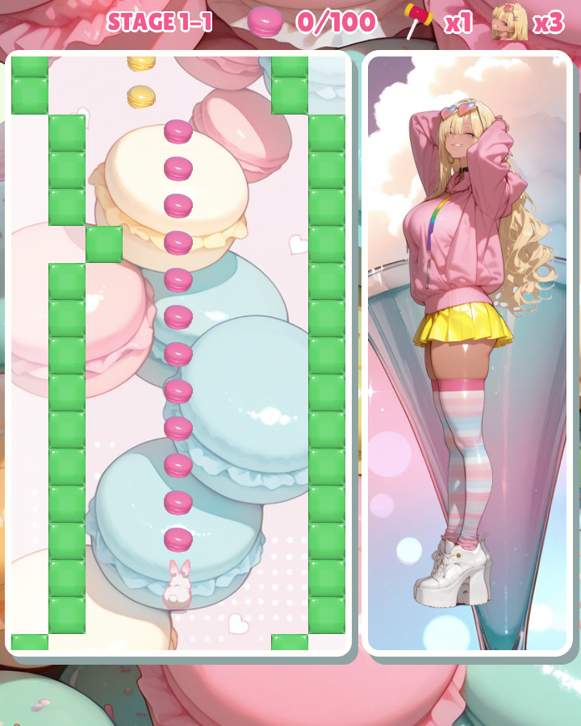
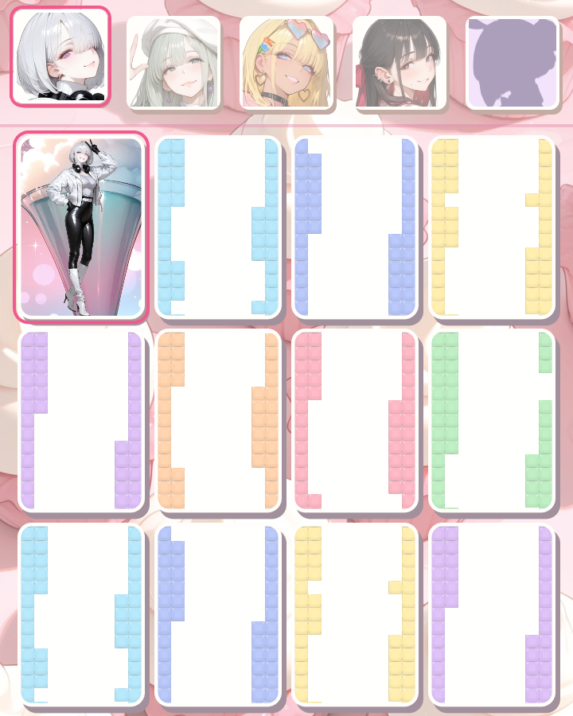
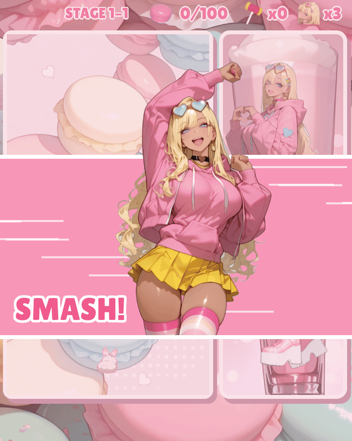
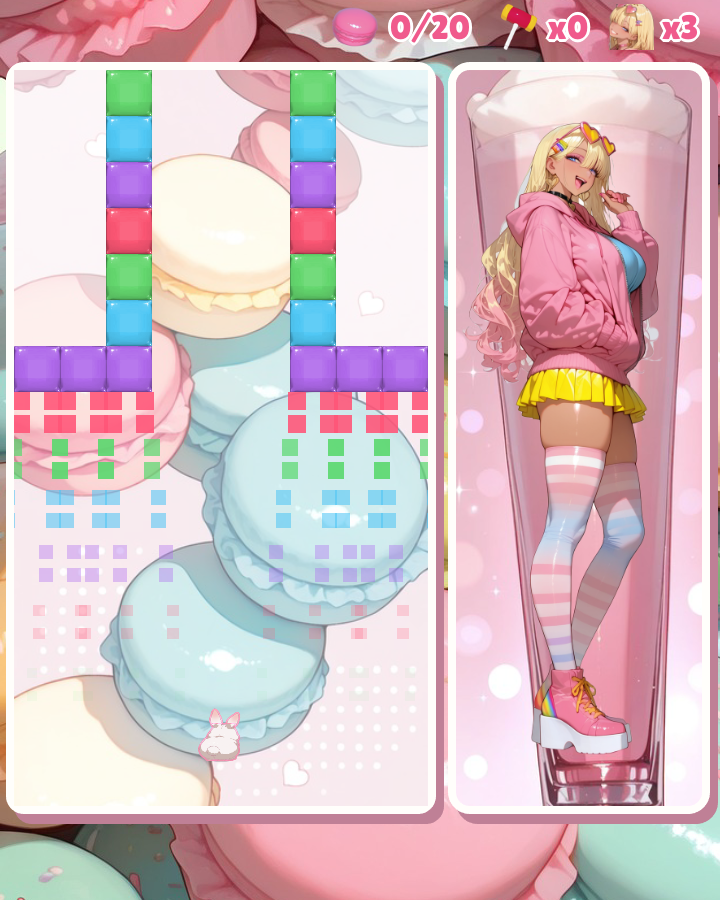
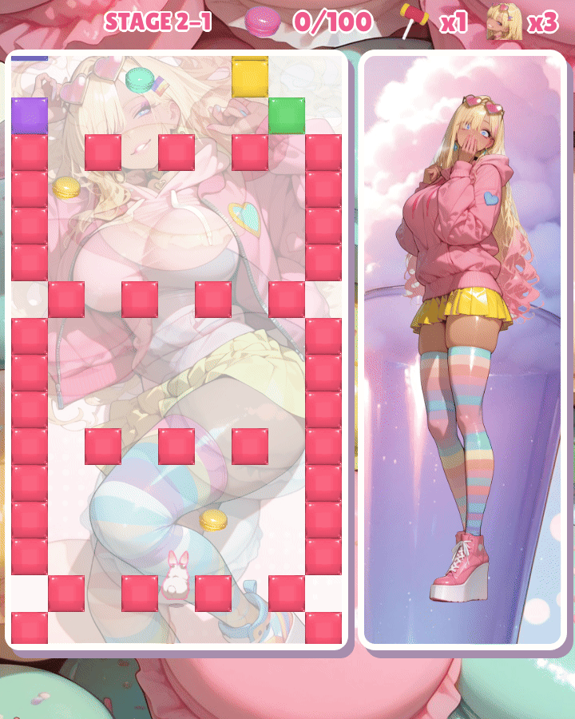
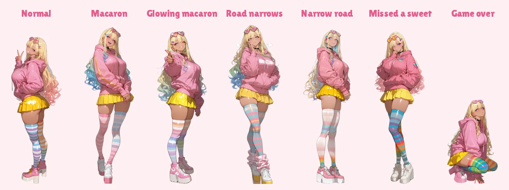

[](https://github.com/nao1215/rabbitrun/actions/workflows/build.yml)
[](https://github.com/nao1215/rabbitrun/actions/workflows/unit_test.yml)
[](https://github.com/nao1215/rabbitrun/actions/workflows/golangci-lint.yml)
[](https://github.com/nao1215/rabbitrun/actions/workflows/reviewdog.yml)
[](https://github.com/nao1215/rabbitrun/actions/workflows/release-smoke.yml)

[](https://github.com/nao1215/atago)
[](https://pkg.go.dev/github.com/nao1215/rabbitrun)

[](https://github.com/nao1215/rabbitrun/releases)
[](https://github.com/nao1215/rabbitrun/releases)
[](https://scorecard.dev/viewer/?uri=github.com/nao1215/rabbitrun)



Rabbit Run is a runner game with anime girls for Windows, macOS, and Linux. You steer a bunny up a road of gummy blocks while your character cheers you on beside it. It is a project for learning how to make a game with AI: the program, the characters and illustrations, the blocks and items, the backgrounds and the music arrangements were all made with AI. It is written in Go with [Ebitengine](https://ebitengine.org/).

<p align="center"></p>

| Title | Character select | Play | Gallery |
| :---: | :---: | :---: | :---: |
|  |  |  |  |

## About this game

Move the bunny with the left and right keys, hold up to speed up, and press Space to swing a hammer that smashes the walls. Each character has her own stages, and a run takes about three minutes.

### Items

| | Item | What it does |
| :---: | --- | --- |
|  | Macaron | Every 100 macarons give a life. Some lie in lines that trace the way along the road. Macarons you go back over on a retry do not come back. |
|  | Hammer | Smashes every wall on the screen. You start with one; more lie on the road now and then, fewer in later stages. |
|  | 1UP | An extra life. |

| Swinging the hammer | The walls breaking |
| :---: | :---: |
|  |  |

### Illustrations

Each course you clear unlocks an illustration of your character, which becomes the background of the next course. The gallery shows everything you have unlocked.

| An unlocked illustration | Behind the next course |
| :---: | :---: |
|  |  |

### Characters

Your character stands beside the road and reacts to the run: she relaxes on a wide road, gets nervous when it narrows, cheers at an extra life or a cleared stage, and cries at a miss. Her face counts your lives. The bunny you steer is the same for every character.



| Character | Portraits | Illustrations |
| :---: | :---: | :---: |
|  | 37 | 15 + α (17) |
|  | 48 | 15 + α (17) |
|  | 74 | 15 + α (17) |
|  | 26 | 15 + α (17) |
|  | 18 | 15 + α (17) |

## How to play

Install Rabbit Run (see [How to install](#how-to-install)) and start it from a terminal:

```shell
rabbitrun
```

On Windows, you can also double-click `rabbitrun.exe`. The game opens in a window; press F11 or Alt+Enter to switch to full screen.

| Action | Keyboard | Gamepad |
| --- | --- | --- |
| Move | ← → / A D / H L | D-pad left / right |
| Speed up (until a miss) | ↑ / W / K | D-pad up |
| Hammer (smash the walls) | Space / Enter | A |
| Pause | Esc / P / F1 | Start |
| Menu up / down | ↑ ↓ / W S / K J | D-pad up / down |
| Confirm / back | Enter / Esc | A / B |
| Switch character in the gallery | Q / E | LB / RB |

Choose PLAY on the title screen, pick a character, and the run starts. GALLERY shows the character portraits you have seen and the illustrations you have unlocked. Your progress is saved to `rabbitrun/save.json` in the user config directory (`~/.config` on Linux, `~/Library/Application Support` on macOS, `%AppData%` on Windows).

## How to install

### Use "go install"

```shell
go install github.com/nao1215/rabbitrun@latest
```

No C compiler is needed. On Linux the game needs the X11, OpenGL and ALSA libraries listed in the [Ebitengine install guide](https://ebitengine.org/en/documents/install.html). On Debian or Ubuntu:

```shell
sudo apt install libx11-6 libgl1 libglx-mesa0 libxcursor1 libxi6 libxinerama1 libxrandr2 libxrender1 libxext6 libasound2t64
```

Rabbit Run needs Go 1.26.6 or later. CI tests Go 1.26.6 and the latest release on Linux, macOS and Windows.

### Use homebrew

```shell
brew install --cask nao1215/tap/rabbitrun
```

### Install from Package or Binary

[The release page](https://github.com/nao1215/rabbitrun/releases) contains packages in .deb, .rpm, and .apk formats for `amd64` and `arm64`, plus `.tar.gz` archives for Linux/macOS and `.zip` archives for Windows. Unpack an archive and run `rabbitrun` (`rabbitrun.exe` on Windows), or install a package:

```shell
# Debian, Ubuntu
$ sudo dpkg -i rabbitrun_0.1.0_linux_amd64.deb

# Fedora, RHEL, openSUSE
$ sudo rpm -Uvh rabbitrun_0.1.0_linux_amd64.rpm

# Alpine Linux
$ sudo apk add --allow-untrusted rabbitrun_0.1.0_linux_amd64.apk
```

Replace `0.1.0` with the release you downloaded and `amd64` with `arm64` where applicable.

### Verifying release integrity

Each release publishes `checksums.txt`, a cosign signature bundle for it, an SBOM for each archive, SLSA build provenance (`multiple.intoto.jsonl`) and GitHub build provenance.

```shell
# Verify the signature of checksums.txt (keyless, via Sigstore)
cosign verify-blob \
  --bundle checksums.txt.sigstore.json \
  --certificate-identity-regexp '^https://github.com/nao1215/rabbitrun/' \
  --certificate-oidc-issuer https://token.actions.githubusercontent.com \
  checksums.txt

# Check the archive you downloaded against it
sha256sum --ignore-missing -c checksums.txt

# Verify the SLSA provenance of an archive
slsa-verifier verify-artifact \
  --provenance-path multiple.intoto.jsonl \
  --source-uri github.com/nao1215/rabbitrun \
  --source-tag v0.1.0 \
  rabbitrun_0.1.0_linux_amd64.tar.gz

# Verify the GitHub build provenance of an archive
gh attestation verify rabbitrun_0.1.0_linux_amd64.tar.gz --repo nao1215/rabbitrun
```

## Command-line options

| Option | Description |
| --- | --- |
| `-h`, `--help` | Show the help and exit. |
| `-V`, `--version` | Print the version and exit. |
| `--debug` | Unlock every character, portrait and illustration for this run. The save data is not changed. |
| `--reset-save` | Delete the save data and exit without starting the game. The old save is kept next to it as `save.json.bak`. |
| `--capture DIR` | Save a screenshot of every screen to `DIR` and exit. The save data is not changed. |
| `--bgm-wav DIR` | Write each background music arrangement to `DIR` as WAV and exit. |
| `--record-demo FILE` | Let the game play by itself and save it as a video to `FILE` (needs ffmpeg). The save data is not changed. |
| `--record-char ID` | The character of the demo recording (`gyal` by default). |
| `--record-stage N` | The stage the demo recording starts at, from 1 to 4. |
| `--record-seconds N` | The length of the demo recording in seconds (60 by default). |
| `--record-extra` | Record the demo on the extra stages. |

A mistake in the options, such as an unknown option, a stray argument or two of `--capture`, `--bgm-wav`, `--reset-save` and `--record-demo` at once, exits with status 2 before the game opens. A failure while doing the job, such as a directory that cannot be written, a screenshot that cannot be saved or ffmpeg failing during `--record-demo`, exits with status 1.

## Contributing

Bug reports, ideas and pull requests are welcome. See [CONTRIBUTING.md](./CONTRIBUTING.md) for how to build, test and lint the game.

## Contributors

Thanks to these people ([emoji key](https://allcontributors.org/docs/en/emoji-key)):

<!-- ALL-CONTRIBUTORS-LIST:START - Do not remove or modify this section -->
<!-- prettier-ignore-start -->
<!-- markdownlint-disable -->
<table>
  <tbody>
    <tr>
      <td align="center" valign="top" width="14.28%"><a href="https://debimate.jp/"><br /><sub><b>CHIKAMATSU Naohiro</b></sub></a><br /><a href="https://github.com/nao1215/rabbitrun/commits?author=nao1215" title="Code">💻</a> <a href="#design-nao1215" title="Design">🎨</a> <a href="#audio-nao1215" title="Audio">🔊</a></td>
    </tr>
  </tbody>
</table>

<!-- markdownlint-restore -->
<!-- prettier-ignore-end -->

<!-- ALL-CONTRIBUTORS-LIST:END -->

This project follows the [all-contributors](https://github.com/all-contributors/all-contributors) specification. Contributions of any kind welcome!

## Spoilers

Open these only if you want to know the secrets.

<details>
<summary>Secret character</summary>

The fifth card on the character select screen shows only a silhouette until each of the first four characters has cleared the game (run all sixteen courses to the end).

</details>

<details>
<summary>Secret command</summary>

Clear the game with the secret character, and the next title screen tells you the secret word. On the title screen, type `RABBITRUN` on the keyboard, in capitals. The extra stages open: every character runs a new, tighter set of courses and unlocks another fifteen illustrations, and the title shows all the characters together. Type it again to go back to the regular stages; the game always starts on the regular ones. Once you have typed it, the gallery also lists the extra illustrations.

</details>

<details>
<summary>The last reward</summary>

Clear the extra stages with every character, and the title screen gets an illustration of its own.

</details>

If you just want to see every character and picture, start the game with `--debug`, or look at the images in this repository on GitHub. I hope you play and unlock them yourself, though.

## Limitations

- I am not used to image generation yet, so the characters' faces and outfits sometimes look slightly different from one picture to another.
- This game is a learning project. I made it to learn how to build a game together with AI.

## License

The source code and the bundled artwork are released under the [MIT License](./LICENSE). The fonts and the score data of the music have their own licenses. See [NOTICE.md](./NOTICE.md).
